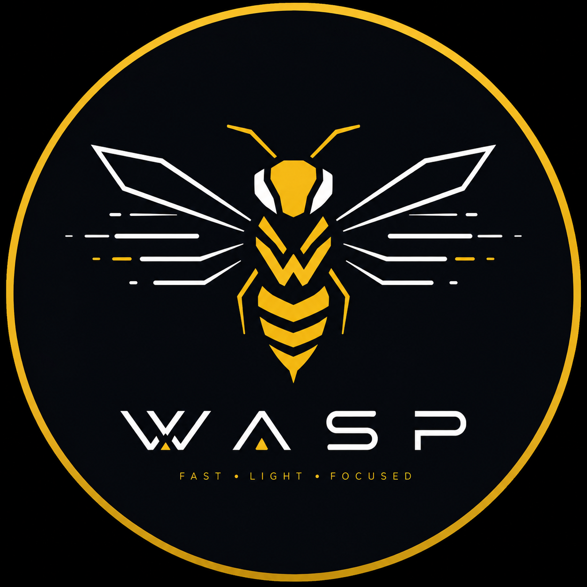

<p align="center"></p>

<h1 align="center">wasp</h1>

<p align="center"><em>Fast · Light · Focused</em></p>

---

**wasp** is a fork of [dwl] (dwm for Wayland) aiming for one thing dwl
deliberately doesn't do: a config you can change without recompiling.
Everything lives in `~/.config/wasp/config.lua`, and (once reload lands —
see Status below) reloading it takes a save and a keypress, not a rebuild.
Beyond that, wasp keeps dwl's own goals — small, hackable, few dependencies,
suckless in spirit — and pulls in a handful of [dwl-patches] adapted to fit
this model rather than `config.h` + recompile.

## Status (2026-08-12)

Early — most of this is still config.h-driven dwl underneath. What's
actually working so far:

- **Forked from dwl `main`**, full upstream git history kept.
- **Bar**: the [dwl-patches] `bar` + `barconfig` patches applied and
  verified live — a real dwm-style status bar (text via fcft/pixman/tllist),
  fed status text over `stdin` the classic dwl way (`your-script | wasp`).
- **Lua config, appearance so far**: wasp embeds Lua 5.4 (`luaconfig.c`/
  `.h`) and loads `~/.config/wasp/config.lua` at startup. Border width/
  colors, the bar's enable/position/layout, and the background color are
  live-driven from it right now — see `examples/config.lua`. Verified by
  eye in a nested session.

Not done yet: keybindings, autostart, gaps, resize, more border styles, and
actually *reloading* the config without restarting (right now it's read
once at startup — the reload trigger itself is still to come). The full
running list, plus which [dwl-patches] are earmarked for which feature and
why, lives in [`NOTES.md`](NOTES.md) — that's the file to check for current
plans, not this README.

## Building

Same dependencies as upstream dwl, plus Lua 5.4:

- libinput, wayland, wlroots (libinput backend), xkbcommon
- wayland-protocols, pkg-config (compile-time only)
- fcft, pixman, tllist (for the bar)
- **lua5.4** (development headers — e.g. `lua54-devel` on Void Linux)

XWayland needs libxcb, libxcb-wm, and a wlroots built with X11 support;
enable it by uncommenting the relevant lines in `config.mk`.

```sh
make
sudo make install
```

## Configuring

Copy the example to get started:

```sh
mkdir -p ~/.config/wasp
cp examples/config.lua ~/.config/wasp/config.lua
```

`examples/config.lua` is both the default and the reference — it's a short
file right now, appearance-only, and will grow as more of `config.h` moves
over to Lua. See [`NOTES.md`](NOTES.md) for what's coming.

## Credit

wasp is a fork — nearly everything here is [dwl]'s work, not wasp's own.
The original dwl README (build details, community links, project
philosophy, acknowledgements to Devin J. Pohly and the rest of the dwl
contributors) is preserved at [`doc/NOTES.md`](doc/NOTES.md) rather than
overwritten. wasp's own additions are licensed the same way — see
`LICENSE`.

[dwl]: https://codeberg.org/dwl/dwl
[dwl-patches]: https://codeberg.org/dwl/dwl-patches
